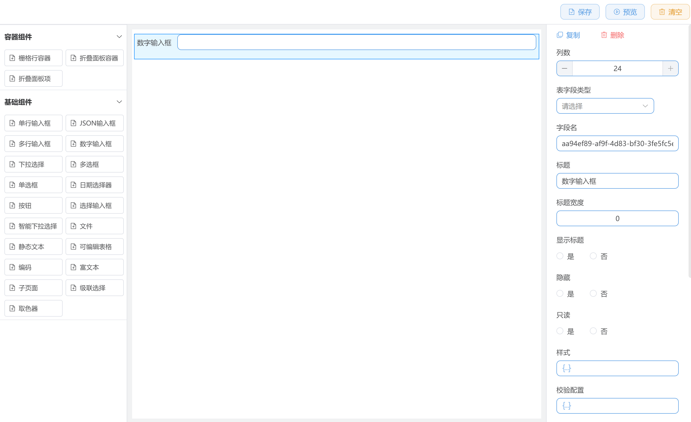

# 低代码平台开发需求书

## 项目背景

本项目旨在开发一个基于Vue 3的低代码平台演示版本，使用Ant Design Vue组件库，让用户通过拖拽方式快速构建表单和数据可视化页面，无需编写代码。

## 技术栈要求

- 框架：Vue 3 + TypeScript
- UI组件库：Ant Design Vue
- 状态管理：Pinia
- 路由：Vue Router
- 构建工具：Vite
- 包管理器: pnpm

## 功能需求详述

### 1. 系统页面结构

系统需包含两个主要页面：

1. **设计页面**：用于拖拽设计低代码页面
2. **预览页面**：用于展示设计后的实际效果

### 2. 设计页面详细交互

#### 2.1 界面布局

设计页面分为四个主要部分：

- **左侧物料区**：展示可用组件列表，支持拖拽
- **中间渲染区**：实时显示页面设计效果，支持组件选中高亮
- **右侧属性设置区**：配置选中组件的属性
- **顶部操作栏**：包含保存、预览、清空等功能按钮

#### 2.2 物料区组件（至少包含以下组件）

~~1. **容器组件**~~

- 栅格行容器（Row）

  - 列数配置：支持1-24列自由分配
  - 列间距（gutter）：支持配置水平间距
  - 水平对齐排列方式：左对齐、居中对齐、右对齐、两端对齐、分散对齐
  - 可嵌套
  - 限制：只能作为栅格列容器的父组件

- 栅格列容器（Col）
  - 限制：只能作为栅格行容器的子组件

2. **基础表单组件**

   - 输入框（Input）
   - 下拉选择框（Select）
   - 日期选择器（DatePicker）
   - 单选/复选框（Radio/Checkbox）
   - 按钮（Button）
   - 基础表单组件只能放置在表单组件内

3. **高级组件**
   - 表单（Form）：可配置多个表单项
     - 表单组件只能范围基础表单组件
   - 表格（Table）：支持数据展示和基本操作
   - 图表（Chart）：至少支持柱状图、折线图、饼图

#### 2.3 组件拖拽与交互

- 从左侧物料区拖拽组件到中间渲染区
- 点击渲染区组件时，组件高亮显示
- 右侧属性面板同步显示选中组件的可配置属性
- 支持组件的移动、删除、调整大小等基本操作

#### 2.4 属性配置面板

每种组件有其特定的属性配置项：

1. **通用属性**

   - 组件ID
   - 宽度/高度
   - 位置坐标
   - 样式设置（颜色、边框等）

2. **数据属性**

   - 数据源配置（REST API URL）
   - 刷新频率设置
   - 请求方式（GET/POST等）
   - 请求参数配置

3. **组件特有属性**
   - 表单：字段配置、校验规则
   - 表格：列配置、分页设置
   - 图表：图表类型、数据映射

#### 2.5 页面操作功能

- **保存按钮**：将当前设计保存为JSON配置
- **预览按钮**：跳转到预览页面查看实际效果
- **清空按钮**：清除当前设计内容

### 3. 预览页面功能

- 根据设计页面保存的JSON配置动态渲染页面
- 各组件按照配置的数据源获取数据并展示
- 按照配置的刷新频率自动更新数据
- 表单组件支持数据提交（可使用模拟数据）

### 4. 技术架构要求

#### 4.1 组件抽象

- 所有可用组件需抽象为标准化的Schema结构
- 组件Schema至少包含：类型、属性、事件、数据绑定

#### 4.2 JSON配置结构

- 页面配置JSON结构应包含：
  ```json
  {
    "version": "1.0",
    "title": "页面标题",
    "layout": {
      "type": "flex|grid|free",
      "props": {}
    },
    "components": [
      {
        "id": "组件唯一ID",
        "type": "组件类型",
        "props": {
          // 组件属性
        },
        "style": {
          // 样式属性
        },
        "dataSource": {
          "type": "static|api",
          "url": "API地址",
          "method": "GET|POST",
          "params": {},
          "refreshInterval": 0 // 秒，0表示不自动刷新
        },
        "children": []
      }
    ]
  }
  ```

#### 4.3 数据交互规范

- 所有数据交互使用JSON格式
- API请求需符合RESTful规范
- 表单提交数据格式需符合后端接收标准

#### 4.4 组件动态渲染机制

- 实现基于JSON配置的组件动态渲染
- 支持组件嵌套和组合
- 处理组件间的数据传递和事件交互

### 5. 模拟数据

- 由于只需实现前端功能，需提供以下模拟数据：
  - 表单提交响应
  - 表格数据源
  - 图表数据源

### 6. 界面参考

设计页面布局参考如下：


## 开发优先级

1. 完成基础框架搭建，实现页面布局
2. 实现基本组件的拖拽和属性配置
3. 实现组件的动态渲染机制
4. 实现数据绑定和API交互功能
5. 实现预览页面功能
6. 优化用户体验和界面美观度

## 技术实现注意事项

1. 确保组件库与框架版本兼容
2. 代码结构清晰，便于扩展和维护
3. 实现响应式设计，适配不同屏幕尺寸
4. 注重用户体验，操作流畅直观
5. 添加适当的错误处理和提示机制

## 代码规范

1. 文件夹和文件使用kebab-case命名
2. 样式使用scss，需要符合BEM规范
3. 类型文件应该以`d.ts`结尾，例如`types.d.ts`
